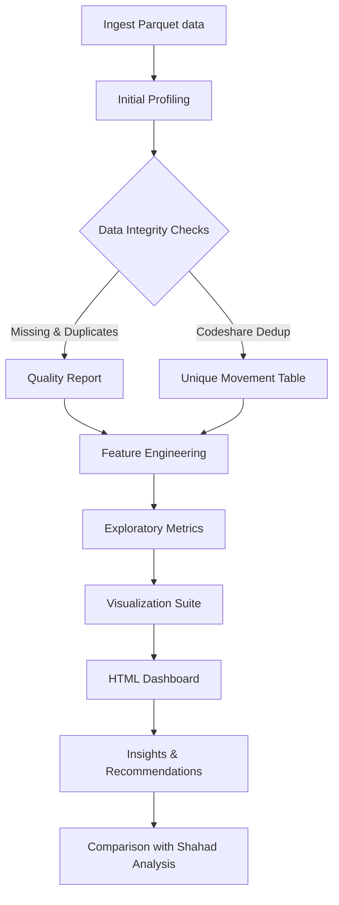

# Analysis Blueprint

## Dataset Snapshot
- 153,308 movement records captured across 23 columns (arrivals and departures).
- Dense missingness in aircraft identifiers: 76% `aircraft.reg`, 70% `callSign` and `aircraft.modeS`.
- 4.1% of records share the same route type and scheduled UTC time, signalling duplicates/codeshares.
- Observation window: 2025-03-14 to 2025-10-10 (UTC timestamps).

## Analytical Objectives
1. Quantify true flight movements vs. duplicated records and surface the "trick" hinted by the data owner.
2. Profile traffic volumes over time (daily, weekly, monthly) and by movement type (arrival/departure).
3. Evaluate airline performance and network reach (top carriers, route coverage, cargo share).
4. Examine terminal utilisation and movement quality signals to assess operational reliability.
5. Highlight destination patterns, including domestic vs. international distribution and time-zone spread.

## Methodological Pillars
- **Data integrity checks:** missingness analysis, duplicate detection, and codeshare disentanglement using keys (`flight_type`, `movement.scheduledTime.utc`, `origin`/`destination`).
- **Feature engineering:** derive calendar attributes (date, day-of-week, month), unique movement identifiers, domestic/international flags, and schedule buckets (hour-of-day).
- **Exploratory analytics:** aggregated statistics, anomaly detection (spikes/dips), and segmentation by airlines, destinations, and terminals.
- **Visual storytelling:** time-series trends, route/network visuals, and categorical comparisons using consistent colour palettes.
- **Comparative assessment:** stack our conclusions against the external analysis (Shahad.md) after completing independent work.

## Workflow Diagram

## Key Deliverables
- `analysis_log.md`: step-by-step rationale documenting each analytical decision.
- Python analysis scripts driving data preparation, metrics, and chart production.
- Saved visual assets (PNG/SVG) aligned with the dashboard narrative.
- Interactive-leaning HTML summary compiling visuals and insights.
- Comprehensive README tailored for students, covering data context, tooling, and learnings.
